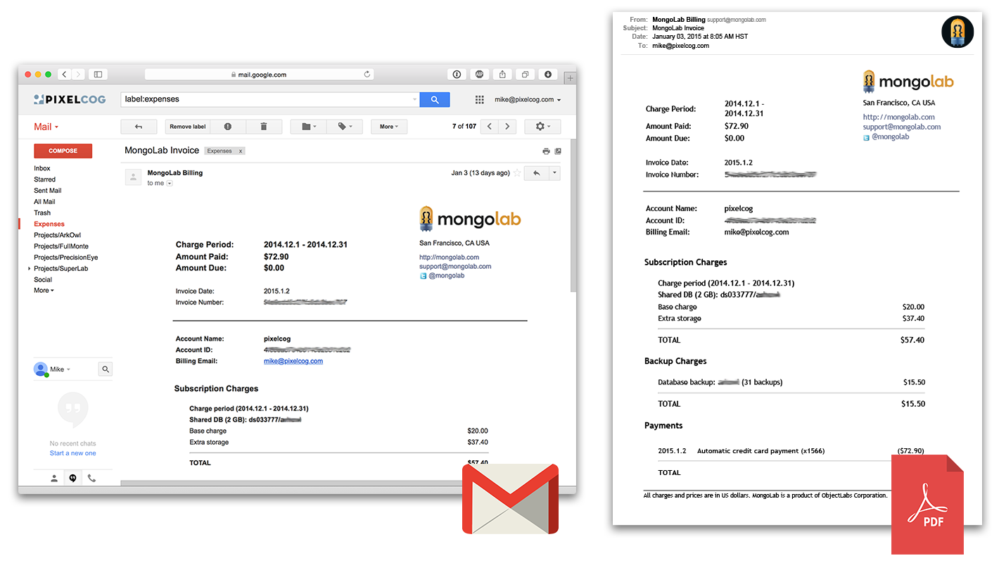

Gmail To PDF
============

A helpful collection of Google Apps Script utilities which allow you to
painlessly transform Gmail messages into PDFs.

This handles all of the heavy-lifting needed to preserve all attachments,
inline-images, remote images, backgrounds, etc. Also included are a few helpful
methods for creating virtual queues within your Gmail labels, using either
unread status or starred status as a signifier.




## Getting Started

To get started, you can either open the [example project][2], create a copy, and
modify it to your liking, or you can create a new [Google Apps Script][1]
project and add [GmailUtils][3] and [DriveUtils][4] as libraries by going to
**_Resources_ > _Libraries..._** and entering the following project IDs:

* `MsE3tErxE9G0z6EMfGmUGqVVaKzeOjMwH`
* `MUDdULBfiLdgEZ13bA9paOlVaKzeOjMwH`

Alternatively, you can import GmailUtils.gs or DriveUtils.gs into your own
project and access the library directly with no name spacing.

[1]: https://script.google.com/ (Google Apps Script)
[2]: https://script.google.com/d/1qdkT9ShXl4VWO9XvKefcxmH_oRJe31MPDyIDsOKyGidKr-GHBpULLtvx/edit?usp=sharing (Example Project)
[3]: https://script.google.com/d/1V9HLEXHv4-7muXGhMS0XC-Lon5WX1CQhtfmjmaVp7WSHoeswwfkq1-90/edit?usp=sharing (GmailUtils Project)
[4]: https://script.google.com/d/1eCTCV107E322s7R_04tLwIg2Q059xEoUytFHBZS5ccbw4TS_DBBOADGo/edit?usp=sharing (DriveUtils Project)


## Example Usage

Iterate through all starred messages with the label 'Expenses' (up to 5 messages
per call), convert each to a PDF, and save them to Google Drive, then unstar
each message after archival.

```javascript
function saveExpenses() {
  GmailUtils.processStarred('label:Expenses', 5, function(message) {

    // create a pdf of the message
    var pdf = GmailUtils.messageToPdf(message);

    // prefix the pdf filename with a date string
    pdf.setName(GmailUtils.formatDate(message, 'yyyyMMdd - ') + pdf.getName());

    // save the converted file to the 'Expenses' folder within Google Drive
    DriveUtils.getFolder('Expenses').createFile(pdf);

    // signal that we are done with this email and it will be marked as read
    return true;
  });
}
```

Convert the 10 most recent unread messages in the "promotions" category into a
single pdf, mark them as read, and email the digest to yourself.

```javascript
function unreadPromotionsDigest() {
  var to = Session.getActiveUser().getEmail(),
  subject = 'Latest promotional emails',
  body = "here's your unread promotional emails:",
  messages = [];

  // limit this to 10 threads (may be more than 10 messages)
  GmailUtils.processUnread('category:promotions', 10, function(message) {
    messages.push(message);
    return true;
  });

  // convert the group of messages into a single pdf
  var pdf = GmailUtils.messageToPdf(messages, {filename: 'recent_promos.pdf'});

  // email the converted document
  GmailApp.sendEmail(to, subject, body, {attachments: [pdf]});
}
```


LICENSE
=======

The MIT License (MIT)

Copyright (c) 2015 PixelCog Inc.

Permission is hereby granted, free of charge, to any person obtaining a copy
of this software and associated documentation files (the "Software"), to deal
in the Software without restriction, including without limitation the rights
to use, copy, modify, merge, publish, distribute, sublicense, and/or sell
copies of the Software, and to permit persons to whom the Software is
furnished to do so, subject to the following conditions:

The above copyright notice and this permission notice shall be included in all
copies or substantial portions of the Software.

THE SOFTWARE IS PROVIDED "AS IS", WITHOUT WARRANTY OF ANY KIND, EXPRESS OR
IMPLIED, INCLUDING BUT NOT LIMITED TO THE WARRANTIES OF MERCHANTABILITY,
FITNESS FOR A PARTICULAR PURPOSE AND NONINFRINGEMENT. IN NO EVENT SHALL THE
AUTHORS OR COPYRIGHT HOLDERS BE LIABLE FOR ANY CLAIM, DAMAGES OR OTHER
LIABILITY, WHETHER IN AN ACTION OF CONTRACT, TORT OR OTHERWISE, ARISING FROM,
OUT OF OR IN CONNECTION WITH THE SOFTWARE OR THE USE OR OTHER DEALINGS IN THE
SOFTWARE.